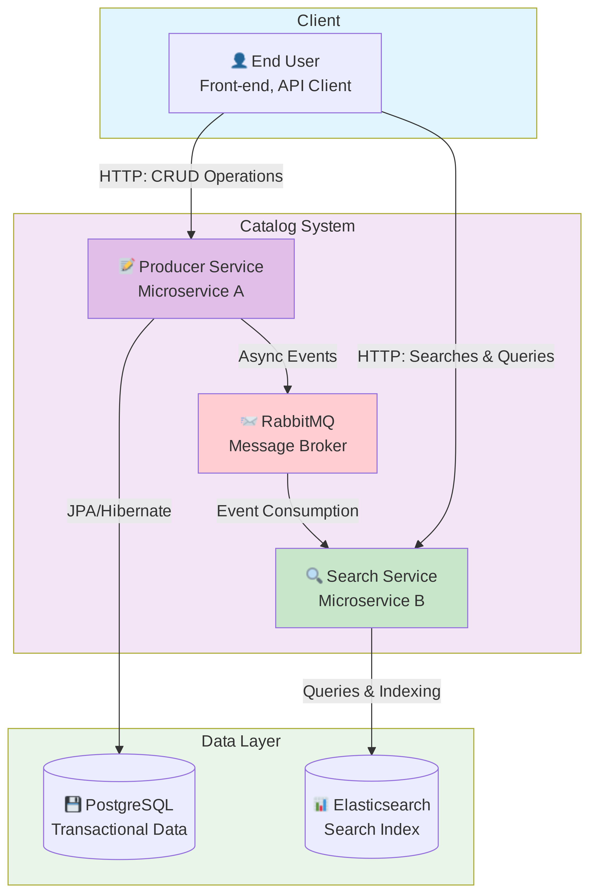
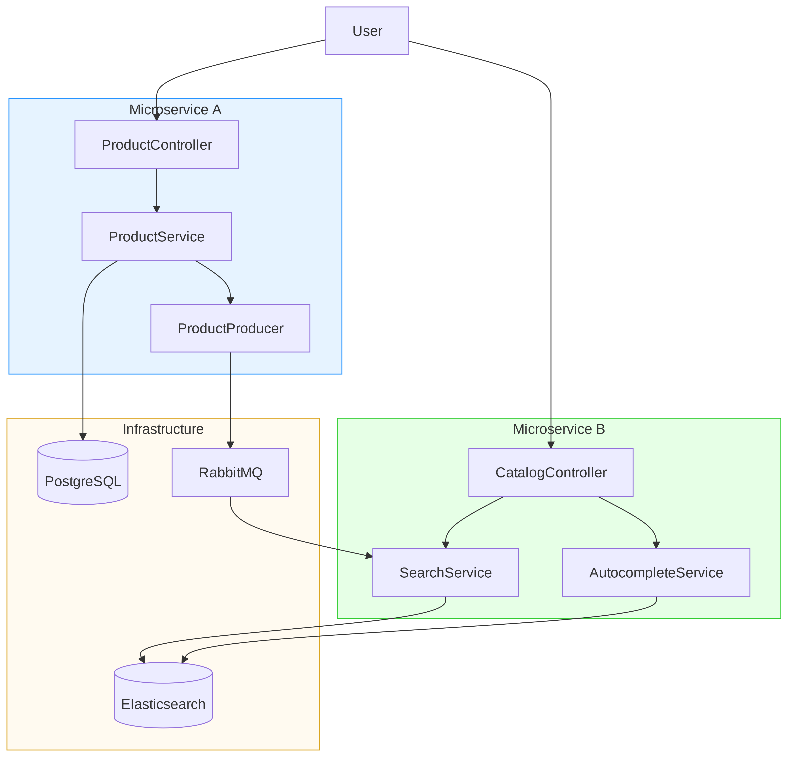
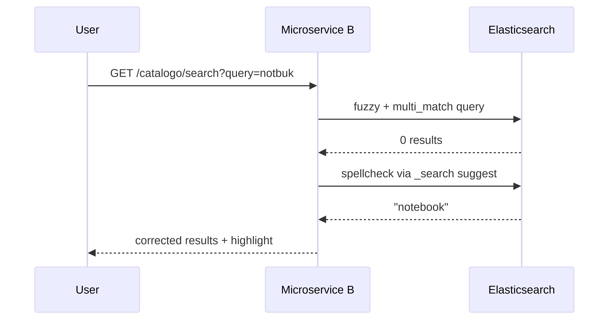
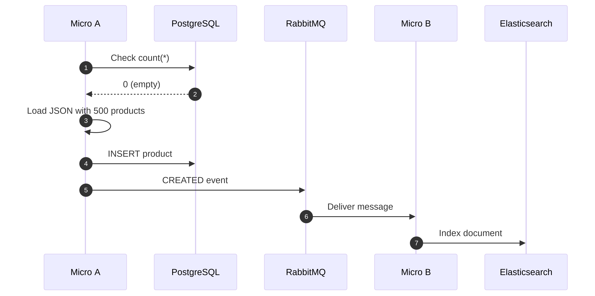
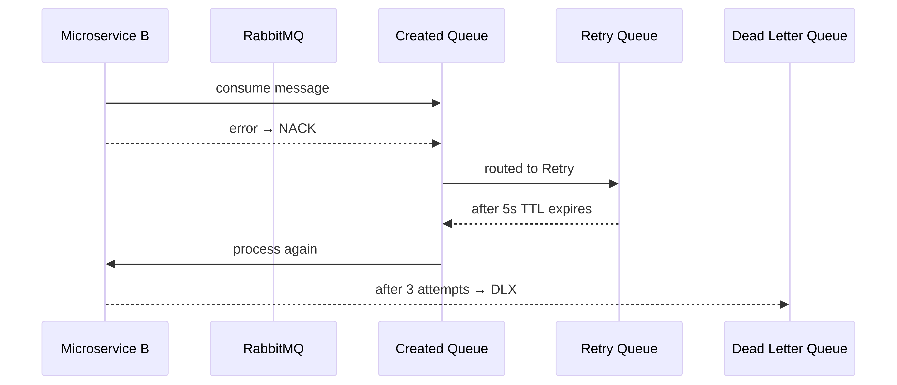
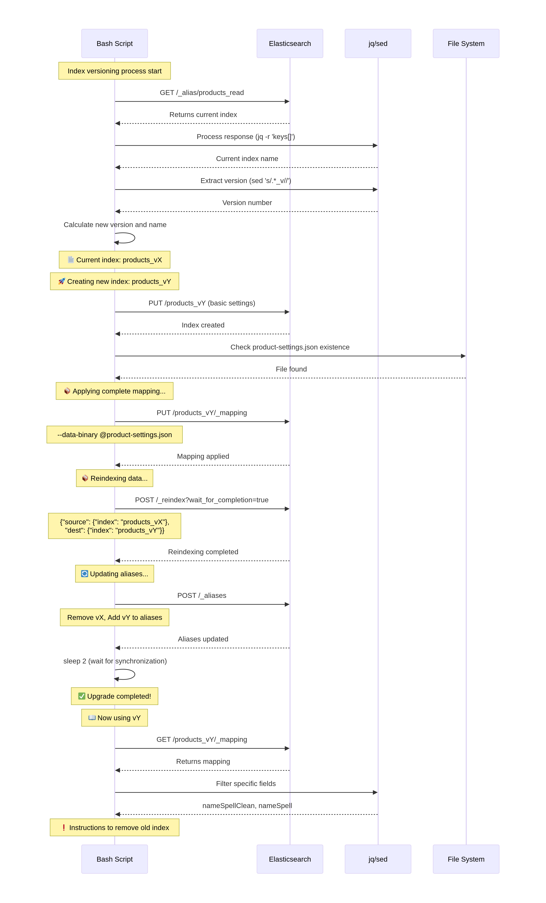

<p align="center">
  
</p>

# 📘 Wekers - Elasticsearch Microservice A/B


### **Product Catalog with PostgreSQL + RabbitMQ + Elasticsearch**

### **Microservice A (Producer) + Microservice B (Consumer/Query)**

---
## 🌐 Language
- 🇺🇸 You are reading the English version.
- 🇧🇷 [Portuguese version](README_PT.md)

---

## 📑 Table of Contents
- [🎯 Overview](#-overview)
- [🏗 Architecture](#-architecture)
- [🛠 Tech Stack](#-tech-stack)
- [🚀 First Run](#-first-run)
- [📡 API Endpoints](#-api-endpoints)
- [🔍 Advanced Features](#-advanced-features)
- [🐇 RabbitMQ Messaging](#-rabbitmq-messaging)
- [📊 Queue Dashboard](#-queue-dashboard)
- [🗂 Elasticsearch Management](#-elasticsearch-management)
- [💾 Backup & Restore](#-backup--restore)
- [📚 How to Study This Project](#-how-to-study-this-project)
- [🐛 Troubleshooting](#-troubleshooting)
- [🚀 How to Evolve This Project](#-how-to-evolve-this-project)

---

## 🚀 Prerequisites
- Docker & Docker Compose
- Java 21
- Maven
- Git
- jq (for JSON scripts)

---

## 🎯 Overview
This project demonstrates a **Distributed Catalog** with advanced search, autocomplete, spell correction, asynchronous indexing, DLQ, retry, intelligent seeding, a queue dashboard, and DevOps maintenance scripts — split into:

#### **Microservice A (Producer)**
- PostgreSQL CRUD
- Publishes events to RabbitMQ
- Automatic seeding of 500 products

#### **Microservice B (Consumer)**
- Consumes messages from RabbitMQ
- Indexes products into Elasticsearch
- Provides APIs for:
  - `/search/products`
  - `/catalogo/search`
  - `/catalogo/suggest`
  - PRO Autocomplete (edge-ngram + wildcard)
  - Spell correction (spellcheck)
  - Price filtering, sorting, and pagination

---

## 🏗 Architecture

### High-Level Flow
1. The user calls **Microservice A** (`/products`) to *create/update/delete*.
2. **Microservice A** persists to **PostgreSQL** (source of truth).
3. **Microservice A** publishes an event to **RabbitMQ** (`products.exchange`).
4. **Microservice B** consumes the events, applies idempotency rules, and indexes into **Elasticsearch**.
5. The client performs search and autocomplete through **Microservice B**.

```text
┌──────┐    HTTP/JSON    ┌──────────────┐    JDBC     ┌─────────────┐
│ User │ ──────────────► │ Microservice │ ──────────► │ PostgreSQL  │
│      │                 │      A       │             │             │
│      │                 └──────────────┘             └─────────────┘
│      │                         │
│      │                         │ RabbitMQ
│      │                         ▼
│      │                 ┌──────────────┐    REST     ┌─────────────┐
│Client│ ──────────────► │ Microservice │ ──────────► │ Elastic-    │
│      │   HTTP/JSON     │      B       │             │   search    │
└──────┘                 └──────────────┘             └─────────────┘
```

### C4 – Level 1 (System Context)



---

### C4 – Level 2 (Containers)



---

### 🔁 End-to-End Flow (Sequence Diagram)


* * *

## 🛠 Tech Stack
- **Language**: Java 21
- **Framework**: Spring Boot 3.x
- **Transactional DB**: PostgreSQL 16 (Docker)
- **Search**: Elasticsearch 8.x (Docker)
- **Messaging**: RabbitMQ 3-management (Docker)
- **DB Migrations**: Flyway
- **Build**: Maven
- **Queue Dashboard**: Thymeleaf + RabbitMQ Management UI
- **Utility scripts**: bash + `jq` + `curl`

* * *

## 🚀 First Run

### ⚠️ The Correct Order Is CRUCIAL
```bash
# 1. Clone and prepare
git clone git@github.com:wekers/elasticsearch.git
cd elasticsearch/

# 2. Start infrastructure
docker compose up -d
```
Screenshot:   


```bash
# 3. Reset Elasticsearch index
cd "microsB - Consumer"
sh scripts/reset-index.sh
```
Screenshot:


```bash
# 4. Start Microservice B (terminal 1)
./mvnw spring-boot:run

# 5. Start Microservice A (terminal 2)
cd "../microsA - Producer"
./mvnw spring-boot:run
```

### 📥 Test Files
Download the files in the project root to test:

- [`postman_collection.json`](https://raw.githubusercontent.com/wekers/elasticsearch/refs/heads/main/Wekers-Elasticsearch-uServ-A-B.postman_collection.json)
- [`api.http`](https://github.com/wekers/elasticsearch/blob/main/api.http)

* * *

## 📡 API Endpoints

| Method | Endpoint | Service | Description |
| --- | --- | --- | --- |
| **POST** | `/products` | A | Create product |
| **PUT** | `/products/{id}` | A | Update product |
| **DELETE** | `/products/{id}` | A | Delete product |
| **GET** | `/catalogo/search` | B | Advanced search + fuzzy |
| **GET** | `/catalogo/suggest` | B | Autocomplete |
| **GET** | `/catalogo/products/{id}` | B | Find by ID |
| **GET** | `/queues` | B | Queue dashboard |

### 🔌 Service Ports
```bash
- 8080 → Microservice A
- 8081 → Microservice B
- 5435 → PostgreSQL
- 5672 / 15672 → RabbitMQ
- 9200 → Elasticsearch
- 5601 → Kibana
```

### 📲 Create product:


### 📲 Search product (with a typo):


### ✨ Search Flow




### 📲 Postman example with a typo:


* * *

## 🔍 Advanced Features

### 🅰 Microservice A – Producer (PostgreSQL + Events)

**Responsibilities:**
- CRUD for `ProductEntity` via `/products`
- Persistence in **PostgreSQL**
- Event emission to RabbitMQ
- Automatic seeding of 500 products

**🌱 Smart Seeder:**
- Runs only if the table is empty
- Checks RabbitMQ health first
- Backed by `src/main/resources/seed/products-seed.json`

**Seeder Flow:**




> ⚠️ **Important**: the seeder **does not run** if the broker is not OK.

---
**PostgreSQL in DBeaver:**  


---

### 🅱 Microservice B – Consumer/Search (Elasticsearch)

**Responsibilities:**
- Consume RabbitMQ events
- Keep the catalog index in sync with Elasticsearch
- Expose search APIs:
  - `/catalogo/products/{id}` (find by ID)
  - `/catalogo/search` (paginated + filters + highlight + spellcheck)
  - `/catalogo/suggest` (autocomplete)
  - `/queues` (HTML dashboard for queues)
  - `/queues/api/*` (internal APIs for the dashboard)

✔ Automatically creates the entire RabbitMQ topology  
✔ Idempotent processing  
✔ Optimistic locking based on version  
✔ `unique_key` creation to prevent duplicates  
✔ PRO indexing in Elasticsearch  
✔ HTML highlight  
✔ Spell correction (phrase suggestions)  
✔ Fuzzy search, range, sorting, pagination  
✔ Autocomplete (edge-ngram + phrase-prefix + wildcard fallback)  
✔ Monitoring dashboard  

**🔍 PRO Search:**
- Fuzzy search + spell correction
- `<strong>` highlight
- Price range filters
- Dynamic sorting
- Pagination

**✨ Autocomplete:**
```text
http://localhost:8081/autocomplete.html
```
- Prefix matching
- Edge n-gram
- Fuzzy fallback
- De-duplication


* * *

## 🐇 RabbitMQ Messaging

### Topology
- **Main Exchange**: `products.exchange` (Topic)
- **Dead Letter Exchange**: `products.dlx` (Direct)

### Queues

| Queue | Purpose | TTL |
| --- | --- | --- |
| `products.created.queue` | Create events | - |
| `products.updated.queue` | Update events | - |
| `products.deleted.queue` | Delete events | - |
| `products.retry.5s.queue` | Retries | 5s |
| `products.dead.queue` | Final DLQ | 14 days |

### Retry + DLQ Flow

   


**UI access:** `http://localhost:15672` (guest/guest)</br>
RabbitMQ screenshot:


* * *

## 📊 Queue Dashboard

**URL:** `http://localhost:8081/queues`

**Features:**
- ✅ Real-time view (auto-refresh every 5s)
- ✅ Message counters per queue
- ✅ Peek first messages
- ✅ Automatic JSON highlight
- ✅ Message reprocessing
- ✅ DLQ message deletion

**Internal Endpoints:**
- `GET /queues/api/all-messages` - JSON containing messages
- `POST /queues/reprocess` - Reprocess a message
- `POST /queues/delete` - Delete a DLQ message

Browser view:


* * *

## 🗂 Elasticsearch Management

### Index Versioning
- **Physical indices**: `products_v1`, `products_v2`, `products_v3`, ...
- **Permanent aliases**:
  - `products_read` (queries)
  - `products_write` (indexing)

### Available Scripts
```bash
# Full reset of the index
cd "microsB - Consumer"
sh scripts/reset-index.sh
```
Screenshot:


```bash
# Version upgrade (zero downtime)
sh scripts/upgrade-index.sh
```
Screenshot:   


**Index Versioning Upgrade Script Flow:**



### When to Use Upgrade?
- Analyzer changes
- Mapping changes
- Adding new fields

* * *

## 💾 Backup & Restore

### PostgreSQL

**Backup:**
```bash
cd scripts
sh backup_postgres.sh
```
Screenshot:


**Restore:**
```bash
gunzip < postgres_backup_2025-11-17_14-00-00.sql.gz | docker exec -i postgres psql -U microsa microsa
```
Screenshot:


### Elasticsearch

**Snapshot Setup:**
```bash
cd scripts
sh elastic_backup_setup.sh
sh backup_elasticsearch.sh
```
Screenshot:


**Interactive Restore:**
```bash
sh elastic_restore_manager.sh
```
Screenshot:


**Single Snapshot Restore:**
```bash
sh restore_elasticsearch.sh snapshot_xxx
```
Screenshots:
  


**List Snapshots:**
```bash
curl -s http://localhost:9200/_snapshot/my_backup/_all?pretty
```

* * *

## 📚 How to Study This Project

### 1. Understand the Architecture
- Read the Mermaid diagrams
- Follow the end-to-end flow

### 2. Run the Pipeline
- Observe PostgreSQL → RabbitMQ → Elasticsearch
- Monitor queues at `http://localhost:15672`

### 3. Test Features
- Fuzzy search with typos
- Progressive autocomplete
- Real-time queue dashboard

### 4. Explore Failure Scenarios
- Stop services and observe resilience
- Force reprocessing through the DLQ
- Test concurrency with parallel requests

### 5. Analyze Strategies
- Idempotency and `unique_key`
- Optimistic locking
- Retry patterns + DLX

* * *

## 🐛 Troubleshooting

### Error: "Queue does not exist on startup"
**Solution:** Start Microservice B first (it creates the queues)</br>


### Error: "Connection refused" in Elasticsearch
**Solution:** Wait ~30s after `docker compose up` for Elasticsearch to initialize

### Seeder does not run
**Solution:** Check whether RabbitMQ is reachable on port 15672

### Messages stuck in the DLQ
**Solution:** Use the `/queues` dashboard to reprocess or delete

### Index not created
**Solution:** Run `reset-index.sh` in Microservice B

* * *

## 🚀 How to Evolve This Project
- **🔁 Messaging**: Replace RabbitMQ with Kafka
- **🔍 Search**: Migrate to OpenSearch
- **📊 Observability**: Add metrics with Micrometer + Prometheus
- **🔒 Security**: Implement Keycloak for authentication
- **📈 CDC**: Add Outbox Pattern with Debezium
- **🧪 Testing**: Add Spring Cloud Contract for contract testing
- **🌐 Frontend**: Build a React/Vue UI demo
- **📦 Deployment**: Add Kubernetes manifests

* * *

## 🔗 Useful Links
- **RabbitMQ UI**: `http://localhost:15672` (guest/guest)
- **Kibana**: `http://localhost:5601`
- **Elasticsearch**: `http://localhost:9200`
- **PostgreSQL**: `localhost:5435` (user: microsa, pass: microsa)
- **Postman**: [`postman_collection.json`](https://raw.githubusercontent.com/wekers/elasticsearch/refs/heads/main/Wekers-Elasticsearch-uServ-A-B.postman_collection.json)

* * *

## 📄 License / Usage
MIT — Free for studies, improvements, and professional usage.

Feel free to:
- clone
- modify
- adapt to other domains (e.g., book catalog, movies, etc.)

* * *

### 👉 If this project helped you, a ⭐ in the repository is worth a coffee. ☕🙂

* * *
