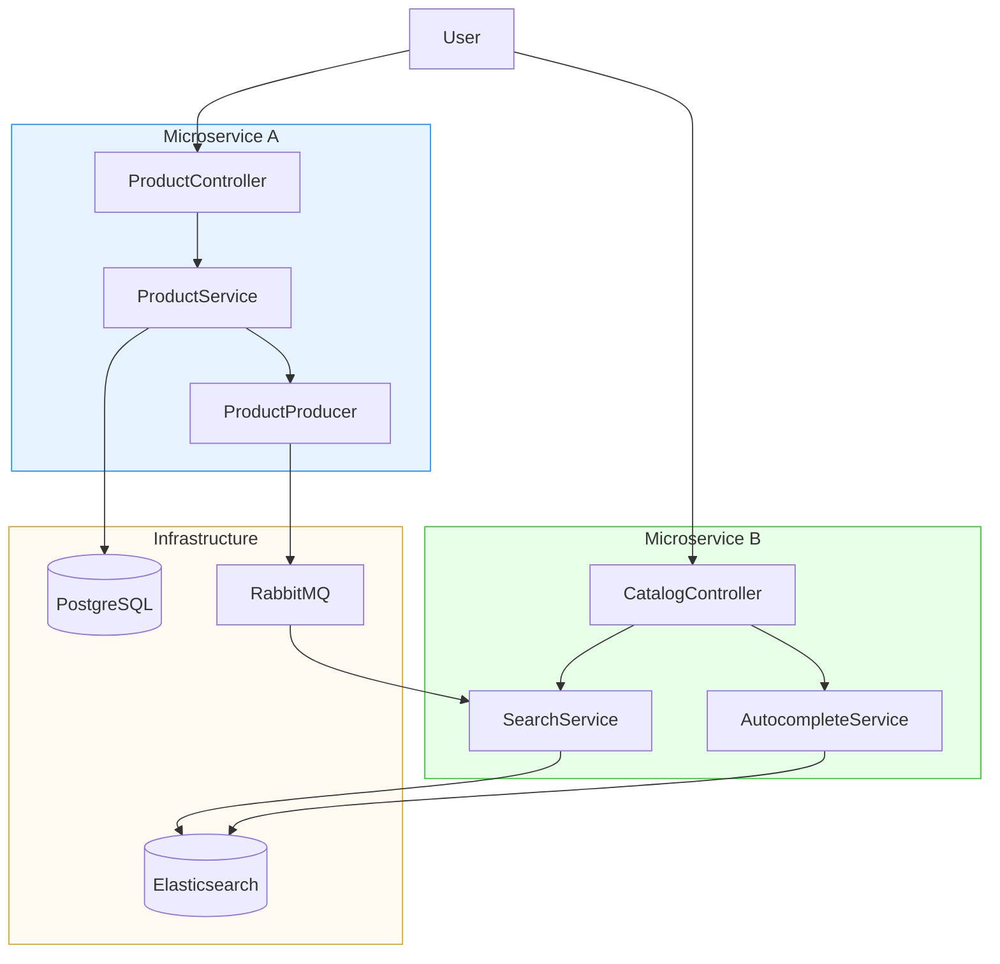

# 📘 Wekers - Elasticsearch Microsserviço A/B


### **Catálogo de Produtos com PostgreSQL + RabbitMQ + Elasticsearch**

### **Microserviços A (Producer) + B (Consumer/Query)**

---
## 🌐 Language
- [Versão em Português do conteúdo do README](README_PT.md) <br/>
- [English version of the README content](https://github.com/wekers/elasticsearch)

---

## 📑 Sumário
- [🎯 Visão Geral](#-visão-geral)
- [🏗 Arquitetura](#-arquitetura)
- [🛠 Stack Tecnológica](#-stack-tecnológica)
- [🚀 Primeira Execução](#-primeira-execução)
- [📡 API Endpoints](#-api-endpoints)
- [🔍 Funcionalidades Avançadas](#-funcionalidades-avançadas)
- [🐇 Mensageria RabbitMQ](#-mensageria-rabbitmq)
- [📊 Dashboard de Filas](#-dashboard-de-filas)
- [🗂 Gestão Elasticsearch](#-gestão-elasticsearch)
- [💾 Backup & Restore](#-backup--restore)
- [📚 Como Estudar](#-como-estudar-este-projeto)
- [🐛 Troubleshooting](#-troubleshooting-comum)
- [🚀 Como Evoluir](#-como-evoluir-este-projeto)
---
## 🚀 Pré-requisitos
- Docker & Docker Compose
- Java 21
- Maven
- Git
- jq (para scripts JSON)

---

## 🎯 Visão Geral

#### **Sistema distribuído com RabbitMQ, Spring Boot, PostgreSQL, Elasticsearch 8+, Autocomplete, Correção ortográfica, Index Versioning, Retry/DLX, Dashboard de filas, Seed inteligente e scripts DevOps.**

Este projeto implementa um **ecossistema completo de catalogação distribuída**.  
**produção → mensageria → indexação → busca**  
Ideal para catálogos, e-commerce, ERP e sistemas que exigem **alta performance de consulta** e **resiliência**, com:

✔ **Persistência confiável no PostgreSQL (Microserviço A)**  
✔ **Mensageria assíncrona via RabbitMQ (durável, resiliente)**  
✔ **Indexação, busca avançada e autocomplete via Elasticsearch (Microserviço B)**  
✔ **Retry automático, Dead Letter Queue, Deleted Queue**  
✔ **Scripts automáticos de migração, reset, upgrade e versionamento de índice**  
✔ **Índice versionado (`products_v1`, `v2`, `v3`...)**  
✔ **Backup/restore de PostgreSQL e Elasticsearch**  
✔ **Dashboard real-time das filas com auto-refresh** customizado em /queues  
✔ **Search PRO com fuzzy, highlight, range, sorting e spell-correction**  
✔ **Autocomplete na barra de busca** acessível via navegador em /autocomplete.html

> Projeto feito sob medida para estudos de: integração assíncrona, mensageria resiliente, sincronização entre bancos e observabilidade de filas.

---

## 🏗 Arquitetura

### Fluxo Alto Nível

1. Usuário chama **Microserviço A** (`/products`) para *criar/atualizar/deletar*.
2. **Microserviço A** grava no **PostgreSQL** (estado de verdade).
3. **Microserviço A** publica evento no **RabbitMQ** (`products.exchange`).
4. O **Microserviço B** consome os eventos, aplica regras de idempotência, e indexa no **Elasticsearch**.
5. O cliente consome buscas e autocomplete via **Microserviço B**.

```text
┌─────────┐    HTTP/JSON    ┌──────────────┐    JDBC     ┌─────────────┐
│ Usuário │ ──────────────► │ Microserviço │ ──────────► │ PostgreSQL  │
│         │                 │      A       │             │             │
│         │                 └──────────────┘             └─────────────┘
│         │                         │
│         │                         │ RabbitMQ
│         │                         ▼
│         │                 ┌──────────────┐    REST     ┌─────────────┐
│ Cliente │ ──────────────► │ Microserviço │ ──────────► │ Elastic-    │
│         │   HTTP/JSON     │      B       │             │   search    │
└─────────┘                 └──────────────┘             └─────────────┘
```

### C4 – Level 1 (System Context)

```mermaid
flowchart TD
    subgraph CLIENTE [Cliente]
        User[👤 Usuário Final<br/>Front-end, API Client]
    end
    
    subgraph APLICACAO [Sistema de Catálogo]
        Producer[📝 Producer Service<br/>Microserviço A]
        Search[🔍 Search Service<br/>Microserviço B]
        RMQ[📨 RabbitMQ<br/>Message Broker]
    end
    
    subgraph DATA [Data Layer]
        PG[(💾 PostgreSQL<br/>Dados Transacionais)]
        ES[(📊 Elasticsearch<br/>Índice de Busca)]
    end
    
    User -->|HTTP: Operações CRUD| Producer
    User -->|HTTP: Buscas & Consultas| Search
    Producer -->|JPA/Hibernate| PG
    Producer -->|Eventos Assíncronos| RMQ
    RMQ -->|Consumo de Eventos| Search
    Search -->|Queries & Indexação| ES
    
    style CLIENTE fill:#e1f5fe
    style APLICACAO fill:#f3e5f5
    style DATA fill:#e8f5e8
    style Producer fill:#e1bee7
    style Search fill:#c8e6c9
    style RMQ fill:#ffcdd2
```


### C4 – Level 2 (Containers)

### 🔁 Fluxo Completo (Sequence Diagram)

```mermaid
    sequenceDiagram
        participant User as User
        participant Client as Client
        participant A as Micro A (PostgreSQL)
        participant RMQ as RabbitMQ
        participant B as Micro B (Consumer)
        participant ES as Elasticsearch
    
        Note over User,B: Fluxo de Escrita
        User->>A: POST /products {dados}
        A->>A: Salva produto no PostgreSQL
        A->>RMQ: Publica evento CREATED/UPDATED/DELETED
        Note over RMQ: Exchange: products.exchange<br/>Routing Key: products.created/updated/deleted
        
        B->>RMQ: Consome evento (manual ACK)
        B->>B: idempotence check + uniqueKey
        B->>ES: Indexa documento no alias "products_write"
        ES-->>B: OK
        B-->>RMQ: ACK mensagem
    
        Note over Client,B: Fluxo de Consulta
        Client->>B: GET /catalog/search?query=...
        B->>ES: Search com highlight
        ES-->>B: Resultados + sugestões
        B-->>Client: JSON response
```

* * *

🛠 Stack Tecnológica
--------------------

*   **Linguagem**: Java 21

*   **Framework**: Spring Boot 3.x

*   **Banco transacional**: PostgreSQL 16 (em Docker)

*   **Busca**: Elasticsearch 8.x (em Docker)

*   **Mensageria**: RabbitMQ 3-management (em Docker)

*   **Migrações DB**: Flyway

*   **Build**: Maven

*   **Dashboard de filas**: Thymeleaf + RabbitMQ Management UI

*   **Scripts utilitários** (bash + `jq` + `curl`)


* * *

🚀 Primeira Execução
----------------------------------

### ⚠️ **Ordem Correta é CRUCIAL**
```bash
# 1. Clone e prepare
git clone git@github.com:wekers/elasticsearch.git
cd elasticsearch/
    
# 2. Subir infraestrutura
docker compose up -d
```
PrintScreen:</br>

```bash
# 3. Resetar índice Elasticsearch
cd "microsB - Consumer"
sh scripts/reset-index.sh
```
PrintScreen:</br>

```bash
# 4. Iniciar Microserviço B (terminal 1)
./mvnw spring-boot:run
    
# 5. Iniciar Microserviço A (terminal 2)
cd "../microsA - Producer"
./mvnw spring-boot:run
```
### 📥 Arquivos de Teste

Baixe os arquivos na raiz do projeto para testar:

*   [`postman_collection.json`](https://github.com/wekers/elasticsearch/blob/main/Wekers%2520Elasticsearch%2520uServ%2520A-B.postman_collection.json)

*   [`api.http`](https://github.com/wekers/elasticsearch/blob/main/api.http)


* * *

📡 API Endpoints
----------------

| Método | Endpoint | Serviço | Descrição |
| --- | --- | --- | --- |
| **POST** | `/products` | A | Criar produto |
| **PUT** | `/products/{id}` | A | Atualizar produto |
| **DELETE** | `/products/{id}` | A | Deletar produto |
| **GET** | `/catalogo/search` | B | Busca avançada + fuzzy |
| **GET** | `/catalogo/suggest` | B | Autocomplete |
| **GET** | `/catalogo/products/{id}` | B | Busca por ID |
| **GET** | `/queues` | B | Dashboard filas |

### 📲 Criar produto:


### 📲 Buscar produto (com erro de digitação):


### 📲 Postman Example:


* * *

🔍 Funcionalidades Avançadas
----------------------------

### 🅰 Microserviço A – Producer (PostgreSQL + Eventos)

**Responsabilidades:**

*   CRUD de `ProductEntity` via `/products`

*   Persistência no **PostgreSQL**

*   Emissão de eventos para RabbitMQ

*   Seed automático de 500 produtos


**🌱 Seed Inteligente:**

*   Executa apenas se tabela vazia

*   Verifica saúde do RabbitMQ antes

*   Baseado em `src/main/resources/seed/products-seed.json`


**Fluxo do Seed:**

```mermaid
sequenceDiagram
    autonumber
    participant A as Micro A
    participant DB as PostgreSQL
    participant R as RabbitMQ
    participant B as Micro B
    participant ES as Elasticsearch

    A->>DB: Verifica count(*)
    DB-->>A: 0 (vazio)
    A->>A: Carrega JSON 500 produtos
    A->>DB: INSERT produto
    A->>R: Evento CREATED
    R->>B: Entrega mensagem
    B->>ES: Indexação

```




> ⚠️ **Importante**: O seeder **não roda** se o broker não estiver OK


**PostgreSQL com DBeaver:**  


### 🅱 Microserviço B – Consumer/Search (Elasticsearch)

**Responsabilidades:**

*   Consumo de eventos RabbitMQ

*   Indexação no Elasticsearch

*   APIs de busca avançada

*   Dashboard de monitoramento


**🔍 Busca PRO:**

*   Fuzzy search + correção ortográfica

*   Highlight com `<strong>`

*   Filtros por range de preço

*   Ordenação dinâmica

*   Paginação


**✨ Autocomplete:**

    http://localhost:8081/autocomplete.html

*   Prefix matching

*   Edge n-gram

*   Fuzzy fallback

*   De-duplicação


* * *

🐇 Mensageria RabbitMQ
----------------------

### Topologia

*   **Exchange Principal**: `products.exchange` (Topic)

*   **Dead Letter Exchange**: `products.dlx` (Direct)


### Filas

| Fila | Propósito | TTL |
| --- | --- | --- |
| `products.created.queue` | Eventos criação | \- |
| `products.updated.queue` | Eventos atualização | \- |
| `products.deleted.queue` | Eventos remoção | \- |
| `products.retry.5s.queue` | Retentativas | 5s |
| `products.dead.queue` | DLQ final | 14 dias |

### Fluxo Retry + DLQ

```mermaid
    sequenceDiagram
        participant B as Microserviço B
        participant R as RabbitMQ
        participant Q as Queue Created
        participant Re as Retry Queue
        participant DLQ as Dead Letter Queue
    
        B->>Q: consume message
        B-->>Q: error → NACK
        Q->>Re: routed to Retry
        Re-->>Q: after 5s TTL expire
        Q->>B: process again
        B-->>DLQ: after 3 attempts → DLX 
```

**Acesso UI:** `http://localhost:15672` (guest/guest)</br>
RabbitMQ PrintScreen:</br>


* * *

📊 Dashboard de Filas
---------------------

**URL:** `http://localhost:8081/queues`

**Funcionalidades:**

*   ✅ Visualização em tempo real (auto-refresh 5s)

*   ✅ Contadores de mensagens por fila

*   ✅ Peek das primeiras mensagens

*   ✅ Highlight JSON automático

*   ✅ Reprocessamento de mensagens

*   ✅ Exclusão de mensagens da DLQ


**Endpoints Internos:**

*   `GET /queues/api/all-messages` - JSON com mensagens

*   `POST /queues/reprocess` - Reprocessar mensagem

*   `POST /queues/delete` - Deletar mensagem DLQ

Visualização via web browser:</br>


* * *

🗂 Gestão Elasticsearch
-----------------------

### Versionamento de Índices

*   **Índices físicos**: `products_v1`, `products_v2`, `products_v3`...

*   **Aliases permanentes**:

    *   `products_read` (consultas)

    *   `products_write` (indexação)


### Scripts Disponíveis
```bash
# Reset completo do índice
cd "microsB - Consumer"
sh scripts/reset-index.sh
```
PrintScreen:</br>

```bash    
# Upgrade de versão (zero downtime)
sh scripts/upgrade-index.sh
```
PrintScreen:</br>


### Quando Usar Upgrade?

*   Mudança de analyzer

*   Alteração de mapping

*   Adição de novos campos


* * *

💾 Backup & Restore
-------------------

### PostgreSQL

**Backup:**
```bash
cd scripts
sh backup_postgres.sh
```
PrintScreen:</br>


**Restore:**
```bash
gunzip < postgres_backup_2025-11-17_14-00-00.sql.gz | docker exec -i postgres psql -U microsa microsa
```
PrintScreen:</br>


### Elasticsearch

**Setup Snapshots:**
```bash
cd scripts
sh elastic_backup_setup.sh
sh backup_elasticsearch.sh
```
PrintScreen:</br>


**Restore Interativo:**
```bash
sh elastic_restore_manager.sh
```
PrintScreen:</br>


**Restore Individual:**
```bash
sh restore_elasticsearch.sh snapshot_xxx
```
PrintScreen:</br>
  


**Listar Snapshots:**
```bash
curl -s http://localhost:9200/_snapshot/my_backup/_all?pretty
```
* * *

📚 Como Estudar Este Projeto
----------------------------

### 1\. **Entender a Arquitetura**

*   Leia os diagramas Mermaid

*   Acompanhe fluxo ponta a ponta


### 2\. **Executar o Pipeline**

*   Observe PostgreSQL → RabbitMQ → Elasticsearch

*   Monitore filas em `http://localhost:15672`


### 3\. **Testar Funcionalidades**

*   Busca fuzzy com erros de digitação

*   Autocomplete progressivo

*   Dashboard de filas em tempo real


### 4\. **Explorar Cenários de Erro**

*   Desligue serviços para ver resiliência

*   Force reprocessamento via DLQ

*   Teste concorrência com requests paralelos


### 5\. **Analisar Estratégias**

*   Idempotência e unique\_key

*   Optimistic locking

*   Retry patterns + DLX


* * *

🐛 Troubleshooting Comum
------------------------

### **Erro: "Queue não existe no startup"**

**Solução:** Execute Microserviço B primeiro (ele cria as filas)</br>


### **Erro: "Connection refused" no Elasticsearch**

**Solução:** Aguarde 30s após `docker compose up` para ES inicializar

### **Seed não executa**

**Solução:** Verifique se RabbitMQ está acessível na porta 15672

### **Mensagens presas na DLQ**

**Solução:** Use o dashboard `/queues` para reprocessar ou deletar

### **Índice não criado**

**Solução:** Execute `reset-index.sh` no Microserviço B

* * *

🚀 Como Evoluir Este Projeto
----------------------------

*   **🔁 Mensageria**: Substituir RabbitMQ por Kafka

*   **🔍 Search**: Migrar para OpenSearch

*   **📊 Observability**: Adicionar métricas com Micrometer + Prometheus

*   **🔒 Security**: Implementar Keycloak para autenticação

*   **📈 CDC**: Inserir Outbox Pattern com Debezium

*   **🧪 Testing**: Adicionar Spring Cloud Contract para testes de contrato

*   **🌐 Frontend**: Criar interface React/Vue para demonstração

*   **📦 Deployment**: Adicionar Kubernetes manifests


* * *

🔗 Links Úteis
--------------

*   **RabbitMQ UI**: `http://localhost:15672` (guest/guest)

*   **Kibana**: `http://localhost:5601`

*   Elasticsearch: `http://localhost:9200`

*   **PostgreSQL**: `localhost:5435` (user: microsa, pass: microsa)

*   **Postman**: [`postman_collection.json`](https://Wekers%2520Elasticsearch%2520uServ%2520A-B.postman_collection.json)


* * *

📄 Licença
----------

MIT – Livre para estudos, melhorias e uso profissional.

Sinta‑se à vontade para:

*   clonar

*   alterar

*   adaptar para outros domínios (ex: catálogo de livros, filmes, etc.)


* * *


### 👉 Se este projeto te ajudou, uma ⭐ no repositório já vale um café. ☕🙂


* * *
